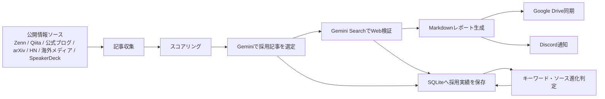
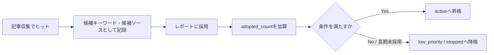
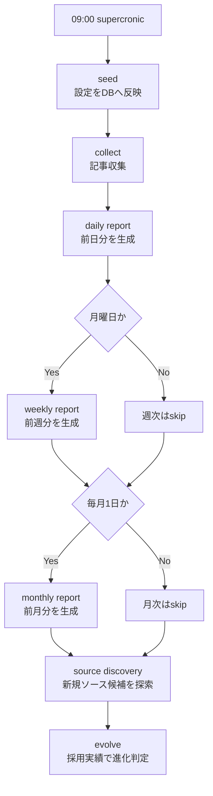

# 公開情報だけでAIニュース収集とレポート作成を自動化する

AI関連の情報収集は、追い始めるとすぐに量が増えます。

Zenn、Qiita、各社の公式ブログ、arXiv、Hacker News、海外メディア、ニュースレター、SpeakerDeck。重要な情報は分散していて、毎日すべてを見に行くのは現実的ではありません。一方で、単にRSSを集めるだけではノイズが多く、「結局どれを読めばいいのか」という問題は残ります。

そこで、公開情報だけを対象にして、AI関連の記事を収集し、Geminiでレポート採用記事を選定し、Google DriveとDiscordへ自動配信する仕組みを作りました。

## 作ったもの

このプロジェクトは、毎朝9時にAI関連の記事を収集し、日次レポートをMarkdownで生成する情報収集ツールです。

週次レポートは月曜日、月次レポートは毎月1日に自動生成されます。生成されたレポートはローカルに保存され、Google Driveにも同期されます。Discord Webhookを設定しておけば、完了通知と上位記事のリンクも送られます。

主な特徴は以下です。

- Zenn、Qiita、公式AIブログ、arXiv、Hacker News、海外AIニュース、ニュースレター、SpeakerDeckを巡回
- Gemini 3.5 Flashでレポートに採用すべき記事を選定
- 海外記事は原文タイトル・原文要約に加えて、日本語タイトル・日本語要約を併記
- 採用記事をGemini Search GroundingでWeb検証
- レポートへの採用実績をDBに保存
- 採用実績をもとにキーワードやソースを自動で昇格・降格
- Docker上で常駐稼働
- Google Driveの個人My DriveへOAuthで同期
- Discordへ通知

## 全体構成

構成はシンプルです。

処理はDockerコンテナ内で動きます。スケジューラーにはsupercronicを使い、crontabで毎日9時に実行します。

Windows環境でも、Docker Desktopが入っていれば常駐運用できます。Windowsのタスクスケジューラではなく、コンテナ内のsupercronicが実行タイミングを管理します。

## 巡回しているソース

現時点では、以下のような公開情報を対象にしています。

- 国内技術コミュニティ: Zenn、Qiita
- 公式・ベンダー: OpenAI、Anthropic、Google AI、Google DeepMind、Hugging Face、Microsoft AI、Meta AI、Mistral AI、NVIDIA、AWS
- 開発者コミュニティ: GitHub Blog AI/ML、LangChain、LlamaIndex、Hacker News
- 研究: arXiv cs.AI、arXiv cs.CL、Microsoft Research
- 海外ニュース・分析: TechCrunch AI、VentureBeat AI、MIT Technology Review AI
- ニュースレター: Import AI、The Batch
- スライド: SpeakerDeckのTechnology、Programming、Research、Scienceカテゴリ

SpeakerDeckについては、カテゴリAtom feedを巡回しています。スライド本文のOCRやPDF全文解析まではしていませんが、AI関連キーワードに反応したスライドは候補として扱われます。

## 記事の評価方法

記事評価は2段階です。

最初に、収集した記事をルールベースでスコアリングします。

評価に使う主な要素は以下です。

- タイトルや本文にAI関連キーワードが含まれるか
- ソースカテゴリが公式・研究・技術コミュニティか
- 記事が新しいか
- QiitaやHacker Newsなどで人気指標があるか
- ソース自体の優先度

この段階でスコアが一定以上の記事だけが、レポート候補になります。

次に、候補記事をGeminiへ渡し、最終レポートに採用する記事を選定します。ここで重視しているのは、単なるキーワード一致ではなく「最終的なレポートに貢献するか」です。

たとえば、以下のような記事を優先します。

- 実務に影響するAIエージェントやLLMアプリケーションの設計
- RAG、評価、推論、ファインチューニング、開発者ツール
- 主要モデルや公式アップデート
- 研究だがエンジニアリング上の示唆があるもの
- 国内技術コミュニティで実装知見があるもの

逆に、似た内容の記事が複数ある場合は、一次情報や実務上有用なものを優先します。

## 海外記事は日本語訳と併記する

海外記事をそのまま貼るだけだと、日々の確認には少し負担があります。

そのため、英語記事など日本語以外の記事については、原文タイトルと原文要約を残しつつ、Geminiが生成した日本語タイトルと日本語要約も併記します。

これにより、一次情報へのリンクは保持しつつ、日本語で素早く内容を把握できます。

## 採用記事をWeb検証する

レポート採用後には、Gemini Search Groundingを使って記事を検証します。

検証では、記事が実在するか、内容が古くないか、より適切な一次情報がないかを確認します。結果はSQLiteの`article_verifications`に保存され、レポート本文にも`Web verification`として表示されます。

この処理は、レポート選定とは分離しています。

理由は、検索結果を直接レポート選定に混ぜると、どの収集ソースが最終アウトプットに貢献したのかが曖昧になるからです。今回の仕組みでは、まず既存の収集ソースから記事を選び、その後に検証補助としてWeb Searchを使います。

## 進化判定

このプロジェクトで重要なのは、ソースやキーワードを「収集数」ではなく「レポート採用実績」で評価する点です。

たとえば、あるキーワードに多くの記事がヒットしても、最終レポートに採用されなければ重要度は上がりません。逆に、収集数が少なくてもレポートに採用される記事を生むキーワードやソースは評価されます。

DBには以下のような情報を記録します。

- どの記事が収集されたか
- どの記事が候補になったか
- Geminiがどの記事を採用したか
- 採用理由
- どのキーワード・ソース由来だったか
- 採用記事のWeb検証結果

この採用実績をもとに、候補キーワードや候補ソースをactiveへ昇格したり、長期間採用されていないものをlow_priorityやstoppedへ降格したりします。

この考え方により、単なるRSSリーダーではなく、運用するほど自分のレポートに合った収集対象へ寄っていく仕組みになります。

## Gemini Searchによるソース発見

Gemini Search Groundingは、採用記事の検証だけでなく、新しい巡回候補の発見にも使っています。

ただし、検索で見つけたものを即座に本採用するわけではありません。まず`source_discoveries`に保存し、RSS/Atomとして取得できるものだけ`candidate`ソースとして登録します。

その後は通常の収集・スコアリング・レポート採用の流れに乗せます。最終レポートへの貢献が確認できればactiveへ昇格し、貢献しなければ停止されます。

このようにすることで、Web Searchの広さを活かしつつ、進化判定の軸は「最終レポートへの貢献度」に保てます。

## Google DriveとDiscord

レポートはローカルの`reports/`以下にMarkdownとして保存されます。

同時に、Google Driveの個人My Driveにも同期します。Drive同期にはサービスアカウントではなく、個人GoogleアカウントのOAuthを使っています。

認証は2種類あります。

- Gemini / Vertex AI: サービスアカウント
- Google Drive / My Drive: OAuth

サービスアカウントだけでは個人のMy Driveへ自然に保存できないため、Drive同期はOAuthで初回認可し、refresh tokenを保存して自動運用します。

Discord Webhookを設定しておけば、レポート生成後に通知も飛びます。Drive同期が成功した場合は、Discord通知にDrive URLも含めます。

## 運用イメージ

毎朝9時の処理は以下のようになります。

## 実装してみて感じたこと

この仕組みで一番大事なのは、LLMを単なる要約器として使うのではなく、レポートに採用する価値があるかを判断する部分に使うことです。

収集はRSSやAPIで機械的に行い、採点で候補を絞り、最後の判断をLLMに任せる。さらに採用実績をDBに残すことで、次回以降の収集対象の評価にも使う。

この流れにすると、LLMの出力がその場限りの文章生成ではなく、システム全体の改善に使えるデータになります。

また、Gemini Search Groundingは便利ですが、検索結果をそのままレポート生成に混ぜると、ソース評価が曖昧になりやすいです。そのため、今回の構成では「採用記事の検証」と「候補ソースの発見」に限定して使っています。

## 今後やりたいこと

今後の改善候補は以下です。

- SpeakerDeckのタグ単位・ユーザー単位の巡回
- スライド本文やPDFの抽出
- 採用記事の重複クラスタリング精度向上
- レポート本文のフォーマット改善
- Google Drive上でのHTML出力やGoogle Docs変換
- 週次・月次レポートの分析観点追加
- コストとトークン使用量の可視化

## まとめ

AI情報収集は、ソースを増やすだけでは解決しません。

重要なのは、何を最終アウトプットに採用したかを記録し、その実績をもとに収集対象を改善していくことです。

このプロジェクトでは、公開情報の収集、Geminiによる選定、Gemini Searchによる検証、Google Drive同期、Discord通知、採用実績による進化判定をDocker上で自動化しました。

毎朝レポートが届き、読んだ結果ではなく「採用された結果」が次の収集品質に反映されていく。そんな個人用AIリサーチ基盤として、今後も改善していく予定です。
